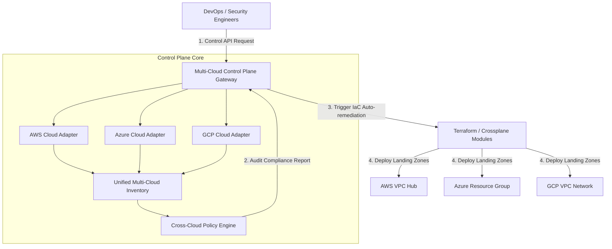

<div align="center">


# Multi-Cloud Control Plane

### Unified Cloud Governance Across AWS, Azure & GCP

**Cross-Cloud Governance • Landing Zone Architecture • Multi-Cloud Hub • Infrastructure Automation** 

[](https://devopstrio.co.uk/)
[](https://devopstrio.co.uk/)
[](https://devopstrio.co.uk/)
[](https://devopstrio.co.uk/)

</div>

---

## Executive Overview

The **Multi-Cloud Control Plane** is an enterprise-grade control plane that unifies infrastructure management, policy governance, and inventory visibility across Amazon Web Services (AWS), Microsoft Azure, and Google Cloud Platform (GCP).

As organizations adopt multi-cloud architectures, operating separate cloud silos introduces compliance risks, security gaps, and operational overhead. This framework provides a centralized landing zone model, cross-cloud policy enforcement, and infrastructure automation.


---

## System Architecture & Workflow



---

## Key Features & Capabilities

* **🌐 Unified Multi-Cloud Inventory**: Single pane of glass for resources across AWS, Azure, and GCP.
* **🛡️ Cross-Cloud Policy Engine**: Enforces mandatory encryption at rest, region locks, and tagging compliance across all clouds.
* **🏗️ Multi-Cloud Landing Zone IaC**: Modular Terraform and Crossplane blueprints for standardizing network hubs and security perimeters.
* **⚡ Infrastructure Automation**: Continuous policy auditing and automated non-compliance detection.
* **📊 Unified API Endpoints**: Centralized REST API for fetching consolidated cloud metrics and compliance reports.

---

## Repository Structure

```
multicloud-control-plane/
├── .github/
│   └── workflows/
│       └── ci.yml               # Automated CI test pipeline
├── docs/
│   ├── ARCHITECTURE.md          # Architectural specification
│   ├── deployment-guide.md      # Multi-cloud deployment guide
│   └── images/
│       └── architecture_diagram.jpg # High-resolution architecture visual
├── src/
│   ├── config.py                # Multi-cloud provider configurations
│   ├── adapters/
│   │   ├── aws_adapter.py       # AWS infrastructure interface
│   │   ├── azure_adapter.py     # Azure infrastructure interface
│   │   └── gcp_adapter.py       # GCP infrastructure interface
│   ├── governance/
│   │   └── policy_enforcer.py   # Unified cross-cloud compliance engine
│   └── control_plane/
│       └── api_server.py        # Central FastAPI Control Plane server
├── terraform/
│   ├── aws/
│   │   └── main.tf              # AWS Landing Zone network module
│   ├── azure/
│   │   └── main.tf              # Azure Landing Zone resource module
│   ├── gcp/
│   │   └── main.tf              # GCP Landing Zone network module
│   └── crossplane/
│       └── provider-aws.yaml    # Kubernetes Crossplane provider manifests
├── tests/
│   ├── test_aws_adapter.py      # AWS unit tests
│   ├── test_azure_adapter.py    # Azure unit tests
│   ├── test_gcp_adapter.py      # GCP unit tests
│   └── test_policy_enforcer.py  # Policy engine unit tests
├── Dockerfile                   # Production container definition
├── docker-compose.yml           # Container orchestration definition
├── requirements.txt             # Python dependencies
└── README.md                    # Project documentation
```

---

## Quick Start & Usage

### 1. Installation

```bash
# Clone repository
git clone https://github.com/Devopstrio/multicloud-control-plane.git
cd multicloud-control-plane

# Install dependencies
pip install -r requirements.txt
```

### 2. Running the Control Plane API

```bash
uvicorn src.control_plane.api_server:app --host 0.0.0.0 --port 8000
```

### 3. Fetch Unified Multi-Cloud Inventory

```bash
curl http://localhost:8000/v1/inventory/unified
```

### 4. Run Cross-Cloud Compliance Audit

```bash
curl http://localhost:8000/v1/governance/audit
```

---

<div align="center">

<sub>&copy; 2026 Devopstrio &mdash; Engineering Uninterrupted Global Workforce Productivity.</sub>

</div>
