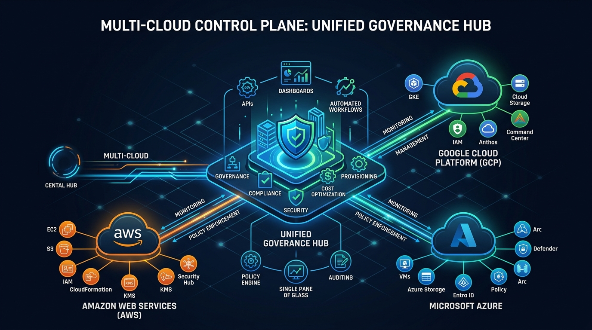
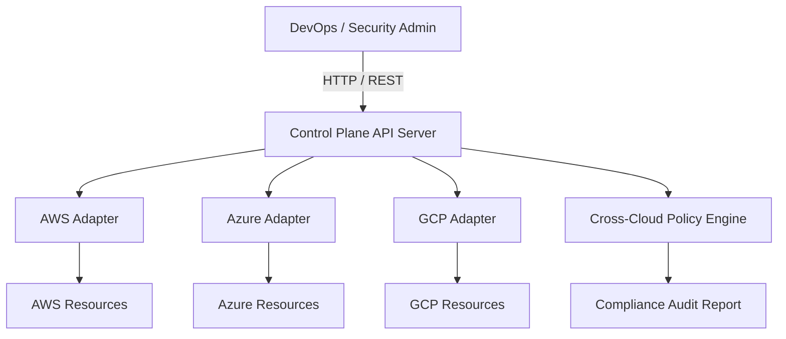

# Multi-Cloud Control Plane Architecture

The **Multi-Cloud Control Plane** provides a unified API, inventory aggregation, policy enforcement, and infrastructure control hub across Amazon Web Services (AWS), Microsoft Azure, and Google Cloud Platform (GCP).

## Architectural Overview

The control plane sits above heterogeneous cloud environments to standardize security, compliance, and infrastructure provisioning.

## Component Breakdown

1. **Central Control Plane API (`src/control_plane/api_server.py`)**
   - Serves unified REST endpoints (`/v1/inventory/unified`, `/v1/governance/audit`).
   - Aggregates resource state across all configured cloud providers with standard Pydantic models.

2. **Cloud Provider Adapters (`src/adapters/`)**
   - `aws_adapter.py`: Interfaces with AWS APIs (EC2, S3, IAM).
   - `azure_adapter.py`: Interfaces with Azure Resource Manager (VMs, Storage Accounts, NSGs).
   - `gcp_adapter.py`: Interfaces with GCP Resource Manager (Compute Engine, GCS, VPC Firewalls).

3. **Unified Policy Enforcer (`src/governance/policy_enforcer.py`)**
   - Scans multi-cloud inventories against enterprise compliance guardrails.
   - Enforces mandatory encryption at rest, region locks, and tagging compliance.

4. **Multi-Cloud Infrastructure Modules (`terraform/`)**
   - Modular Landing Zone definitions for AWS VPC Hubs, Azure Resource Groups, GCP Virtual Networks, and Crossplane CRDs.
